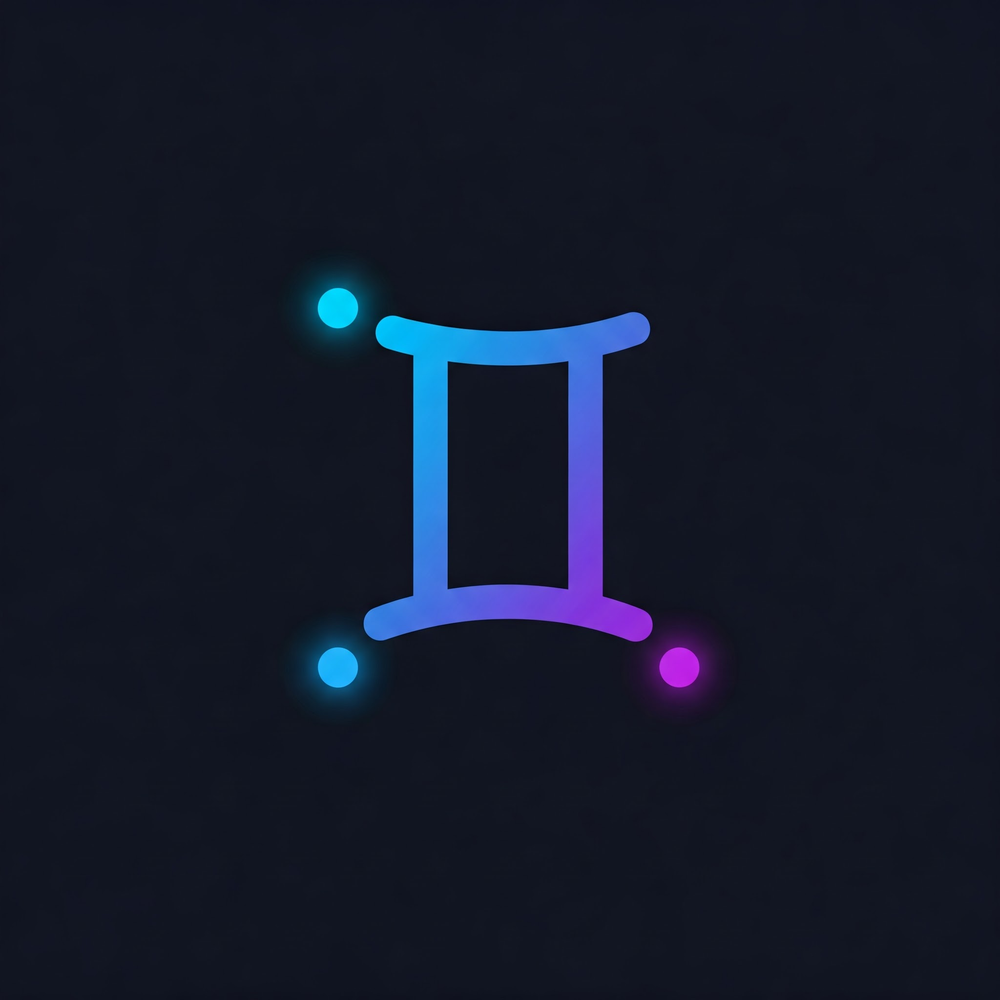

<p align="center">
  <a href="https://github.com/mohamadghaffari/gemini-tel-bot">
    
  </a>
</p>

<h1 align="center">
🤖 Gemini Telegram Bot
</h1>
<h2 align="center"> Best Gemini-powered telegram Bot 😍 </h2>

[](https://github.com/mohamadghaffari/gemini-tel-bot/actions/workflows/mypy.yml)
[](https://github.com/mohamadghaffari/gemini-tel-bot/actions/workflows/uv-integration.yml)
[](https://github.com/mohamadghaffari/gemini-tel-bot/actions/workflows/lint-black.yml)

A versatile Telegram bot built with Python that allows users to chat with Google Gemini models. It supports multi-modal input (text and photos), maintains conversation history, offers flexible deployment (Webhook or Polling), and provides user-specific configuration options via commands and buttons. The bot leverages `MarkdownV2` for rich text formatting, including code blocks, file sending, and Mermaid chart rendering.

## ✨ Features

*   **🤖 AI Chat:** Interact with Google Gemini models (`gemini-1.5-flash-latest` by default or user-selected).
*   **📝📸 Multimodal Input:** Send text messages or photos with captions to the bot.
*   **💾 Conversation History:** The bot remembers previous turns (text and photo captions/placeholders) to maintain context in the conversation (history length is limited by model context window and a configurable limit).
*   **🔑 User API Keys:** Users can set and use their own Google Gemini API key using `/set_api_key` for potentially higher limits or access to models available to their key.
*   **🌍 Bot's Default Key:** A default API key can be configured for users who don't provide their own (can be limited to a certain number of messages via `DEFAULT_KEY_MESSAGE_LIMIT`).
*   **⚙️ Model Selection:** Users can easily list available Gemini models (`/list_models`) and select one using the `/select_model` command with inline keyboard buttons.
*   **📊 Current Settings:** View active API key status, chosen model, and default key message count using `/current_settings`.
*   **↩️ Chat Reset:** Clear conversation history using `/reset`.
*   **🚀 Flexible Deployment:** Supports both **Webhook** mode (recommended for production, requires a publicly accessible server) and **Long Polling** mode (easier for local development and testing).
*   **💅 Rich Formatting (Thanks to [telegramify-markdown](https://github.com/sudoskys/telegramify-markdown/)):**
    *   Properly formats Markdown in AI responses for Telegram (`MarkdownV2`).
    *   Sends code blocks detected in responses as downloadable `.txt` files for better readability and usability.
    *   Renders Mermaid diagrams (e.g., flowcharts, sequence diagrams) directly in the chat if the AI generates them in a Mermaid code block.
    *   Latex Visualization (escaped) and Expanded Citation.

## 📝 Important Notes & Context


*   **💡 Project Origin:** Developed as a practical exercise and demonstration following the **GDG Berlin "Using AI to help solve problems, both big and small!"** event, exploring Google Gemini's capabilities through iterative development.
*   **Limited Multimodal History:** While the bot accepts photos and stores related information, the AI model might not fully "re-see" the image content from previous turns due to API/architectural constraints. Context relies mainly on text placeholders and captions.
*   **Free Tier Considerations:** Deploying on free tiers (like Railway, Supabase) comes with limitations (usage, resources, cold starts) affecting performance. But you can enable a paid plan for handling more users if needed.

## 🛠️ Setup & Running

### 1. Prerequisites

*   Python 3.11+
*   Git
*   uv (see [uv installation guide](https://github.com/astral-sh/uv#installation))
*   A [Supabase](https://supabase.com/) account and project.
*   A [Telegram Bot Token](https://core.telegram.org/bots#6-botfather). You might want **two** tokens: one for production deployment and one specifically for local testing.
*   A [Google AI Studio / Google Cloud Project](https://aistudio.google.com/app/apikey) to get a Gemini API Key (can be used as the bot's default or provided by users).

### 2. Supabase Database Setup

*   To use the bot, you only need to provide your Supabase URL and `service_role` key in the `.env` file.
*   **Note:** The bot automatically initializes the database tables (`user_settings` and `chat_history`) if they don't exist, so you no longer need to use the SQL Editor or manually create the tables.

*   **(Security Note):** The provided code typically uses the Supabase `service_role` key, which bypasses Row Level Security (RLS). If you need finer-grained control or plan to expose Supabase keys differently, configure RLS appropriately.

### 3. Local Setup & Running (Polling Mode)

This is recommended for development and testing.

1.  **Clone the Repository:**
    ```bash
    git clone https://github.com/mohamadghaffari/gemini-tel-bot
    cd <gemini-tel-bot>
    ```
2.  **Install Dependencies:** uv will create and manage a virtual environment for you.
    ```bash
    uv sync
    ```
    uv automatically manages the project's virtual environment. To execute commands within this environment, you can use `uv run`.
    Example: `uv run run-gemini-bot`


3.  **Create `.env` File:** Create a file named `.env` in the project root by copying `.env.example` (e.g., `cp .env.example .env`). **Do not commit the `.env` file to Git!** It should already be in your `.gitignore`. Populate `.env` with your **local testing credentials**:
    ```dotenv
    # .env - For Local Development Only
    BOT_MODE=polling
    BOT_API_KEY=<YOUR_LOCAL_TESTING_BOT_TOKEN> # Use a SEPARATE token for testing
    SUPABASE_URL=<YOUR_SUPABASE_URL>
    SUPABASE_KEY=<YOUR_SUPABASE_SERVICE_ROLE_KEY> # Use service_role key
    GEMINI_BOT_DEFAULT_API_KEY=<YOUR_GEMINI_API_KEY> # Optional default key
    ```
4.  **Run the Bot (Polling Mode):**
    ```bash
    uv run run-gemini-bot
    ```
    The bot will start polling Telegram for updates using your *local testing* bot token. You can interact with this test bot instance. Use `Ctrl+C` to stop.

### 4. Production Deployment (Webhook Mode - e.g., Railway)

This uses a web server (Gunicorn) to handle updates via a webhook.

1.  **Prerequisites:**
    *   A Git repository with your latest code pushed.
    *   A [Railway](https://railway.com?referralCode=6U8dFG) account (or similar PaaS supporting Python WSGI apps).
2.  **Code Structure:** Ensure your project includes:
    *   `pyproject.toml` (Defines dependencies and project metadata for uv. Railway will use this to install dependencies.)
    *   `Procfile` (e.g., `web: uv run gunicorn api.webhook:app --bind 0.0.0.0:$PORT`)
    *   `src/gemini_tel_bot/cli.py` (Handles polling mode startup, invoked by `run-gemini-bot` script).
    *   `api/webhook.py` (WSGI entry point).
    *   All other Python modules (`bot.py`, `handlers.py`, `config.py`, etc.).
3.  **Railway Project Setup:**
    *   Create a new Railway project linked to your Git repository.
    *   Railway should detect the `Procfile` and, given the `pyproject.toml` file, will use uv to build your environment.
4.  **Configure Environment Variables on Railway:**
    *   In Railway's "Variables" tab, set the following (use your **production** credentials):
        *   `BOT_MODE`: `webhook` (Ensure this is set)
        *   `BOT_API_KEY`: `<YOUR_PRODUCTION_BOT_TOKEN>`
        *   `SUPABASE_URL`: `<YOUR_SUPABASE_URL>`
        *   `SUPABASE_KEY`: `<YOUR_SUPABASE_SERVICE_ROLE_KEY>`
        *   `GEMINI_BOT_DEFAULT_API_KEY`: `<YOUR_GEMINI_API_KEY>` (Optional)
        *   `PYTHON_VERSION`: `3.11` (Or your target Python version, good practice for Railway)
5.  **Deploy:** Railway will build and deploy based on your Git pushes. Monitor build/deploy logs.
6.  **Set Telegram Webhook:**
    *   Get your Railway service's public URL (e.g., `https://your-app-name.up.railway.app`).
    *   Construct the full webhook URL: `https://your-app-name.up.railway.app/api/webhook` (This assumes your `api/webhook.py` defines a route that results in this path. For example, if `api/webhook.py` creates a Flask app with `@app.route('/api/webhook')`, or a Blueprint mounted at `/api` with a `/webhook` route).
    *   Set the webhook via browser or `curl`:
        ```
        https://api.telegram.org/bot<YOUR_PRODUCTION_BOT_TOKEN>/setWebhook?url=<YOUR_FULL_WEBHOOK_URL>
        ```
        Verify the success response from Telegram.

## 🎮 Usage

Start a chat with your bot on Telegram (either the local test instance or the deployed production one).

*   Send text messages or photos with captions to chat with the AI.
*   Look out for formatted responses, code sent as files, and rendered Mermaid diagrams!
*   Use commands:
    *   `/start` or `/help`: Show welcome message and commands list.
    *   `/reset`: Clear your chat history.
    *   `/set_api_key`: Start setting your personal Gemini API key.
    *   `/clear_api_key`: Revert to the bot's default key.
    *   `/list_models`: List models available with your current API key.
    *   `/select_model`: Choose a model via buttons.
    *   `/current_settings`: Show your current configuration.

## 🐛 Debugging

*   **Local (Polling):** Check the console output where you ran `uv run run-gemini-bot`. Increase log levels if needed (see [`src/gemini_tel_bot/cli.py`](src/gemini_tel_bot/cli.py)).
*   **Production (Webhook):**
    *   **Railway Logs:** Your primary debugging tool.
    *   **Telegram Webhook Info:** Use `https://api.telegram.org/bot<TOKEN>/getWebhookInfo` to check for errors reported by Telegram (`last_error_message`, `last_error_date`) and the pending update count. Ensure the URL matches exactly what you set.
    *   **Database:** Verify Supabase credentials and table structure.
    *   **AI API:** Check API keys and model validity.

---
